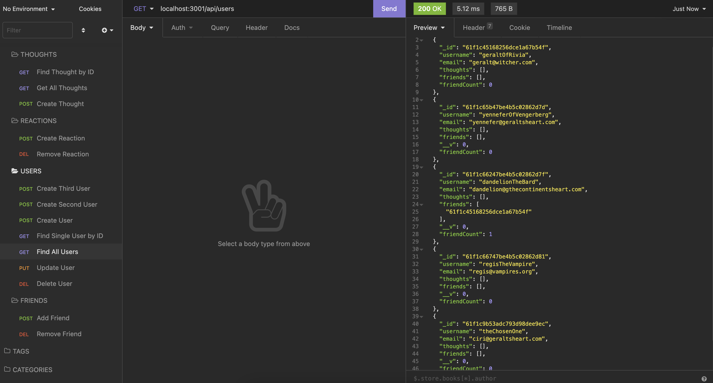
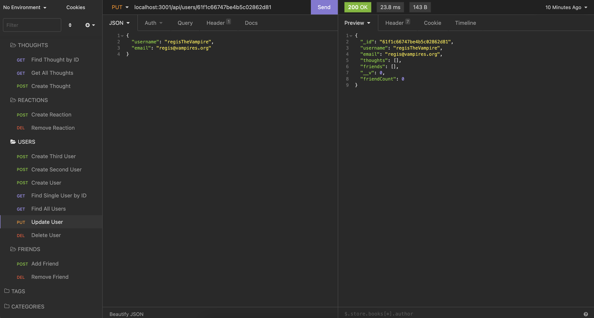
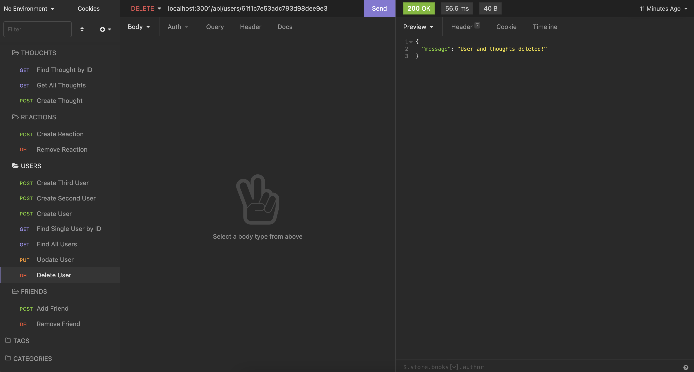

# 🏗️ Social Network API

Link : https://nameless-castle-62595.herokuapp.com/

## Description 📖

**Social Network API** is an API for a social network web application where users can share their thoughts, react to friends’ thoughts, and create a friend list.

## Features 📝

The application uses Express.js for routing, a MongoDB database, and the Mongoose ODM.

## Screenshots 📷 :

* The following shows a GET route to return all users being tested in Insomnia:

  
  
* The following shows a PUT route to update a user being tested in Insomnia:

  

* The following shows a DELETE route to delete a user and their thoughts being tested in Insomnia:

  
  

## Takeaways 💡

I learned how to configure a working Express.js API to interact with a Mongo database using Mongoose.
----
© 2021 Caswell Orr. Confidential and Proprietary. All Rights Reserved.